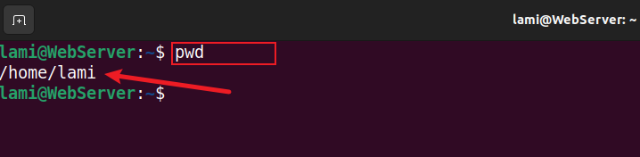
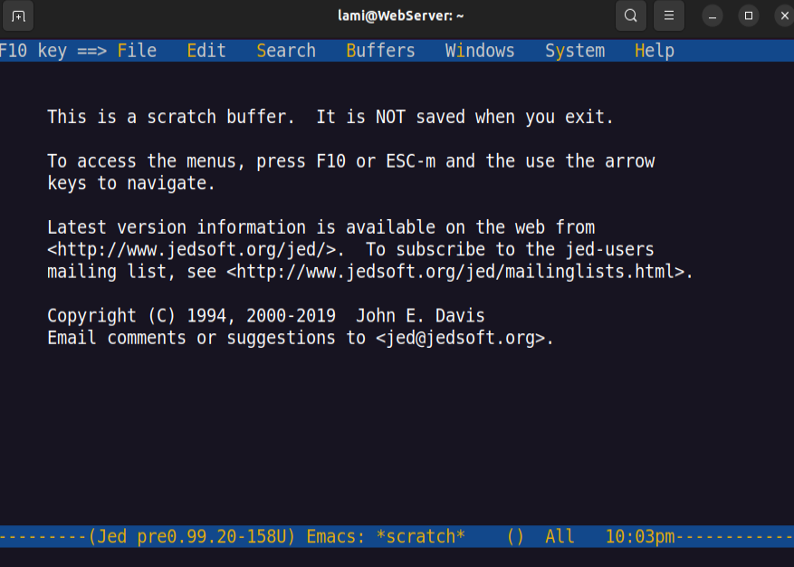
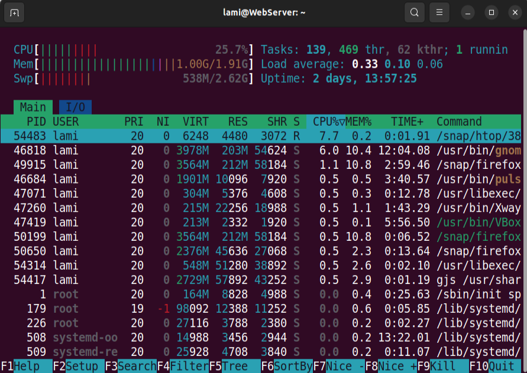

# Linux Project Implementation

In this project, we will be implementing some basic Linux commands.

## 1. sudo command
The sudo command also known as *super user do*. It is a powerful command in linux that enable users to run commands with elevated priviledges to manipulate root files or folders

Syntax for sudo command: `sudo apt upgrade`

## 2. pwd command
The pwd command stands for *Print Working Directory*.  It writes the complete path name of the working directory to standard output in linux.

Syntax for pwd command: its simply `pwd`

## 3. cd command
The "cd" stands for *change directory*. It is one of the most frequently used commands in the Linux terminal.
 cd command is used to change the current working directory ( i.e in which the current user is working).

Syntax: `cd` to change directory.

- `cd ~[username]` to change to another user's home directory
- `cd ..` moves one directory up
- `cd -` move to previous directory

## 4. ls command
The ls command is known as *list*. It is used to list the content of files and directories.

You can use ls command by just typing `ls` in the terminal

To list all the files in the subdirectories 
Syntax: `ls -R`

Other options with ls are - `ls -a` (to show hidden files), `ls -lh` (to show file size in a readable format).

## 5. cat command
Cat is the short of *concatenate*. It is one of the most frequently used linux commands. It is primarily used to display the content of existing files.

Syntax: `cat filename.txt`

The picture below shows how to concatenate multiple files and store them in a new file. 
Syntax for that is: `cat filename1 filename2 > Newfilename`

## 6. cp command
Cp command stands for *copy*. cp command is for copying files and directories from one location to another. 
To copy file from the current directory to another, enter cp followed by the filename and the destination directory.

The picture belows shows how to copy the content of a file to a new file in the same directory.

To copy an entire directory to a new one, enter `cp -R directoryname Newdirectoryname`. See the picture below;

## 7. mv command
The mv command which stands for *move*. The mv command is to move and rename files and directories. It does not produce any output on execution.

Syntax for mv: `mv filename destiantion-directory`

## 8. mkdir command
The mkdir command is known as *make directory* for creating directories. This command can create multiple directories at once as well as set the permissions for the directories. It is important to note that the user executing this command must have enough permissions to create a directory in the parent directory.

Syntax: `mkdir directory-name`

To creat a directory inside another directory, enter `mkdir new_directory/old_directory`. See picture below;

## 9. rmdir command
The rmdir command removes each directory specified on the command line, if they are empty. That is, each directory removed must contain no files.

Syntax: `rmdir directory_name`

## 10. rm command
The rm command removes the files without asking for confirmation and there is no way to undo it since the removed files are not moved into the Trash.

Syntax: `rm filename`

`rm filename filename1 filename2` this is to remove multiple files

## 11. touch command

It is used to create a file without any content. The file created using the touch command is empty. This command can be used when the user doesn't have data to store at the time of file creation.

Syntax: `touch filename`

## 12. locate command
The locate command is the quickest and simplest way to search for files and directories by their names.

Syntax: `locate name/word` or `locate -i name*name2` -i is to maje your search not to be case sensitive while the * is to search two words.

## 13. find command
 find command is a powerful tool for searching for files and directories with various criteria, such as file types or ownership.

 Syntax: `find filename`

 

 ## 14. grep command
 Grep, or global regular expression print, is one of the most versatile and useful Linux commands available. It searches for text and strings defined by users in a given file. Grep allows users to search files for a specific pattern or word and see which lines contain it.

Syntax: `grep "string" filename`

 

 ## 15. df command
 The df command displays information about total space and available space on a file system.

 Syntax: `df [option] filename`

 

 ## 16. du command
 The du *disk usage* command measures the disk space occupied by files or directories. By default, it measures the current directory and all its subdirectories, printing totals in blocks for each, with a grand total at the bottom.

 Syntax: `du [option]`

 

 ## 17. head command
 head command prints the first lines of one or more files (or piped data) to standard output. By default, it shows the first 10 lines. However, head provides several arguments you can use to modify the output.

 Syntax: `head [option] filename`

 

 ## 18. tail command
 Tail is a command which prints the last few number of lines (10 lines by default) of a certain file, then terminates.

 Syntax: `tail [option] filename`

 

 ## 19. diff command
 diff is a command-line utility that allows you to compare two files line by line. It can also compare the contents of directories. The diff command is most commonly used to create a patch containing the differences between one or more files that can be applied using the patch command.

 Syntax: `diff [option] filename1 filename2`

 

 ## 20. tar command
 The tar command archives multiple files into a TAR file

 Syntax: `tar [options] [archive_file] [file or directory to be archived]`

 

 ## 21. chmod command
  chmod command is used to change the access mode of a file. The name is an abbreviation of *change mode*. Which states that every file and directory has a set of permissions that control the permissions like who can read, write or execute the file.

  Syntax: `chmod [option] [permission] [file_name]`

  

  ## 22. chown command
  The chown command changes the owner of the file or directory specified by the File or Directory parameter to the user specified by the Owner parameter. The value of the Owner parameter can be a user name from the user database or a numeric user ID.

  Syntax: `chown [option] owner[:group] file`

  

  ## 23. jobs command
  Jobs command is used to list the jobs that you are running in the background and in the foreground. If the prompt is returned with no information no jobs are present.

  Syntax: `jobs [options] jobID`

  

  ## 24. kill command
  kill command is a built-in command which is used to terminate processes manually. kill command sends a signal to a process that terminates the process.

  Syntax: `kill [signal_option] pid`

  

  ## 25. ping command
  The ping command in Linux is a utility that helps to test connectivity between two devices on a network. ping command sends a request to a specified device and waits for a response. response from device helps us to determine whether device is available or not.

  Syntax: `ping [option] [hostname_or_IP_address]`

  

  ## 26. wget command
  You can use the wget command to download a file from the internet. Files are automatically saved in your current work folder. The download won't take place interactively. This means that processes can be carried out even when you're not logged in.

  Syntax: `wget [option] [url]`

  

  ## 27. uname command
  The uname -a command can be used to display all system information such as the kernel name, hostname, kernel version, operating system, etc.

  Syntax: `uname [option]`

  

  ## 28. top command
   The top *table of processes* command shows a real-time view of running processes in Linux and displays kernel-managed tasks.

   Syntax: `top`

   

   ## 29. history command
   history command keeps a list of all the other commands that have been run from that terminal session, then allows you to replay or reuse those commands.

   Syntax: `history [option]`

   

   ## 30. man command
   man command in Linux is used to display the user manual of any command that we can run on the terminal.

   syntax: `man [command_name]`

   

   ## 31. echo command
   Echo is a Linux command tool used for displaying lines of text or string which are passed as arguments on the command line. This is one of the basic command in linux and most commonly used in shell scripts.

   Syntax: `echo [option] [string]`

   

   ## 32. zip,unzip command
   zip command, an effective tool for compressing files to save disk space and facilitate faster file transfers. 
   The unzip command extracts all files from the specified ZIP archive.

   Syntax: `zip [options] zipfile file1 file2….`   `unzip [option] file_name.zip`

## 33. hostname command
Hostname is the program that is used to either set or display the current host, domain or node name of the system.

Syntax: `hostname [option]`

## 34. useradd, userdel command
useradd command is used to create new accounts while userdel command is used to delete a user account and related files.

Syntax: `useradd [option] username` 
`passwd the_password_combination` 

`userdel username`

## 35. apt-get command
apt-get *advance packaging tool* is a command-line tool that helps in handling packages in Linux. Its main task is to retrieve the information and packages from the authenticated sources for installation, upgrade, and removal of packages along with their dependencies.

Syntax: `apt-get [options] (command)`

## 36. nano, vi, jed command
Nano is a simple yet powerful command line-based text editor, very popular among beginner Linux users for its simple-to-use interface. 
The vi editor tool is an interactive tool as it displays changes made in the file on the screen while you edit the file. 
jed command in Linux is used to open up a text editor called “jed”. It is a friendly editor with a drop-down menu that can be used by programmers in Linux.

Syntax: `nano filename`  
`vi filename`  
`jed`

## 37. alias, unalias command
The alias command lets you create shortcuts for long commands, making them easier to remember and use. It will have the same functionality as if the whole command is run. While The unalias command removes the definition for each alias name specified, or removes all alias definitions if the -a flag is used.

Syntax: `alias Name=String`  
`unalias [aliasname]`

## 38. su command
 The su command is used to switch to another user, granting access to their permissions and privileges.

 Syntax: `su [options] [username [argument]]`

 

 ## 39. htop command
 The htop is a command-line utility that allows you to interactively monitor your system's vital resources or server processes in real-time.

 Syntax: `htop [options]`

 

 ## 40. ps command
 ps command is used to list the currently running processes and their PIDs along with some other information depends on different options.

 Syntax: `ps`

 